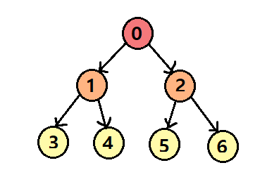

<h1 align = "center"> BFS </h1>

## BFS (Breadth First Search : 너비우선탐색)
* 루트 노드에서 시작해 인접한 노드를 먼저 탐색하는 방법

<br>

### BFS 탐색 순서
* 가장 얕은 노드부터 모두 탐색한 후, 깊은 노드를 탐색하는 방법



<br>

### BFS 동작 방식
* 큐(Queue) 자료 구조 사용 : FIFO (First In First Out) 방식

#### BFS 기본 과정
* 시작 노드를 큐에 넣고 방문 표시
* 큐에서 노드를 꺼내고, 해당 노드의 인접 노드(연결된 노드)를 모두 큐에 추가
* 더 이상 방문할 노드가 없을 때까지 반복

<br>

### BFS 특징

#### 최단 경로 보장
* 가중치가 없는 그래프에서 출발점과 목적지까지의 최단 거리를 찾을 때 최적의 방법이 됨

#### 큐 사용 
* 먼저 들어온 노드가 먼저 처리되므로 탐색 순서를 제어할 수 있음

#### 모든 경우를 탐색 (완전 탐색)
* 한 레벨씩 탐색하기 때문에 모드 노드를 방문할 수 있음

#### 노드 방문 순서가 항상 일정
* 항상 동일한 순서로 노드를 방문

#### 시간 복잡도 O(V + E)
* V : 노드(정점)의 개수
* E : 간선의 개수
* BFS는 모든 노드를 한 번씩 방문하면서, 인접한 간선을 체크하므로 O(V + E)의 시간 복잡도를 가짐

<br>

### BFS 예시

#### 인접 리스트 BFS
* 메모리 : O(N + M)
* 순회속도 : O(N + M)
* 정점이 많고 간선이 적을 때 효율적
* 희소 그래프일 때 적합
* 연결된 노드만 저장하므로 필요 없는 공간을 차지하지 않음
* 간선 존재 여부를 확인하려면 O(N)이 걸림
* 검색 속도가 인접 행렬보다 느릴 수 있음

``` python
from collections import deque

def bfs(graph, start):
    q = deque([start])
    visited = [False] * (len(graph) + 1)
    visited[start] = True

    while q:
        node = q.popleft()
        print(node, end = " ")

        for neighbor in graph[node]:
            if not visited[neighbor]:
                q.append(neighbor)
                visited[neighbor] = True


graph = {
    1: [2, 3, 4],
    2: [5, 6],
    3: [7],
    4: [],
    5: [],
    6: [],
    7: []
}

bfs(graph, 1)

```

<br>

#### 인접 행렬 BFS
* 정점 개수가 N개라면 N x N 크기의 2차원 배열을 사용
* 모든 간선 정보를 빠르게 조회 가능 → O(1)
* 구현이 직관적이고 간단함
* 밀집 그래프(Dense Graph)에 적합
* 메모리 사용량이 많음 → O(N^2)
* 간선이 적은 희소 그래프(Sparse Graph)에서는 비효율적

``` python
from collections import deque

def bfs_matrix(graph, start):
    n = len(graph)  # 정점 개수
    visited = [False] * n
    q = deque([start])
    visited[start] = True

    while q:
        node = q.popleft()
        print(node, end=" ")

        for i in range(n):
            if graph[node][i] == 1 and not visited[i]:  # 연결되어 있고 방문 안 했으면
                q.append(i)
                visited[i] = True

# 그래프 (0번부터 시작)
graph_matrix = [
    [0, 1, 1, 1, 0, 0, 0, 0],  # 0번 노드
    [1, 0, 0, 0, 1, 1, 0, 0],  # 1번 노드
    [1, 0, 0, 0, 0, 0, 1, 0],  # 2번 노드
    [1, 0, 0, 0, 0, 0, 0, 0],  # 3번 노드
    [0, 1, 0, 0, 0, 0, 0, 0],  # 4번 노드
    [0, 1, 0, 0, 0, 0, 0, 0],  # 5번 노드
    [0, 0, 1, 0, 0, 0, 0, 1],  # 6번 노드
    [0, 0, 0, 0, 0, 0, 1, 0]   # 7번 노드
]

bfs_matrix(graph_matrix, 0)  # 0번 노드에서 시작

```